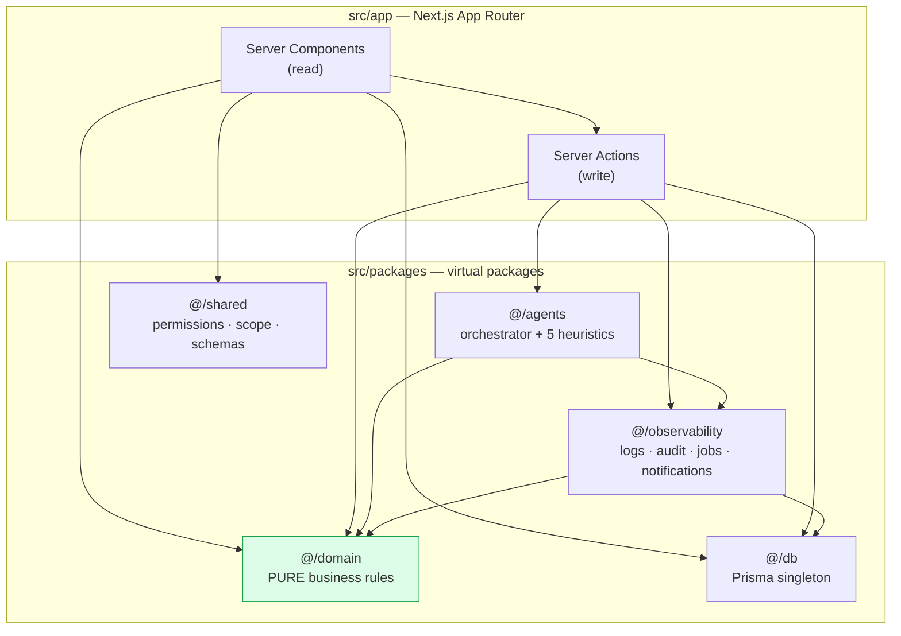

# 🎓 EduOps Platform

A school operations cockpit built as a **software engineering training laboratory**.

Students, teachers, courses, sections, enrollments, assignments, grades, attendance and
counselling interventions — wrapped in a production-shaped observability layer (structured
logs, audit events, a background job queue) and an **agent layer** of five deterministic
analysts that read the database, reason in traceable steps, and persist reports you can
inspect.

```
Next.js 14 (App Router) · React 18 Server Components · Prisma 5 · SQLite · TypeScript strict
```

---

## Why this repo exists

Two things are being taught here at once.

**1. How a real application is structured.** This is a *modular monolith*: five virtual
packages with an enforced dependency direction, business rules isolated as pure functions,
mutations that audit themselves, and slow work pushed to a queue.

**2. How real engineering work is delivered.** Every feature in this repo arrived through
a branch, a series of explained commits, and a pull request. The git history is not
exhaust — it is the curriculum. Read it:

```bash
git log --oneline --graph --all
```

Start with [`CONTRIBUTING.md`](CONTRIBUTING.md), which documents the exact workflow every
commit here follows and why each convention exists.

---

## Quick start

```bash
npm install
npm run db:push      # sync prisma/schema.prisma -> prisma/dev.db
npm run db:seed      # WIPES the db and rebuilds the demo scenario
npm run dev          # http://localhost:3000
```

There is no login. Use the **role switcher in the top-right header** to become an Admin, a
School Manager, a Teacher, an Advisor, a Student or a Parent, and watch permissions and
visible data change underneath you.

| Command | What it does |
| --- | --- |
| `npm run dev` | Dev server on :3000 |
| `npm run build` | **The real gate.** Full strict TypeScript check. |
| `npm test` | Domain rule unit tests (`node:test`, no framework) |
| `npm run db:seed` | Reset to the known demo scenario |
| `npm run db:studio` | Browse the database in a GUI |

> After changing `prisma/schema.prisma`, run `npm run db:push` **and restart the dev
> server** — otherwise the generated Prisma types are stale.

---

## The demo scenario

The seed builds a small school with a story in it:

- **Maya Johnson** is in crisis: missing Algebra assignments and a run of absences. She has
  an active intervention plan from advisor Clara Vance. The dashboard risk engine finds
  her without being told to.
- **A background job is deliberately broken.** The seeded `AttendanceSummary` job has
  `runDate: null` and throws a real `TypeError` when you retry it on `/jobs`. It exists so
  you can practise reading a stack trace in a job monitor — it is a fixture, not a defect.

---

## Architecture in one diagram



**The one rule:** `@/domain` imports nothing. Not Prisma, not Next.js, not the logger. It
takes plain values and returns plain objects, which is why it can be unit-tested in
milliseconds and why the same grading formula can be trusted by a page, an action, a job
and an agent simultaneously.

---

## The agent layer

Five analysts live in `src/packages/agents/registry/`. They are **deterministic
TypeScript**, not LLM calls — deliberately, so you can learn the *shape* of an agentic
system without an API key or non-determinism:

```
input snapshot → reasoning trace → structured output → persisted run → human review UI
```

| Agent | Target | What it produces |
| --- | --- | --- |
| `StudentProgressSummary` | Student | Narrative report with grade-trajectory analysis |
| `AtRiskStudentDetection` | Student | 0–100 risk score and escalation recommendations |
| `AssignmentFeedback` | Submission | Draft student feedback + private teacher notes |
| `AttendanceAnomaly` | Student / Section | Absence streaks; section-wide single-day drop-offs |
| `TeacherWorkloadInsight` | Teacher | Staffing redistribution advice |

Every run persists its input snapshot, its confidence score, its **self-reported
limitations**, and its full chain-of-thought trace. Open any run at `/agent-runs/[id]` to
see all of it, and compare it against a previous run to see what changed and why.

---

## Documentation

| Doc | What it covers |
| --- | --- |
| [`CONTRIBUTING.md`](CONTRIBUTING.md) | **The git workflow this repo teaches.** Branches, commit messages, PR bodies, review habits. |
| [`fabledocs/01-how-this-app-works.md`](fabledocs/01-how-this-app-works.md) | Full architecture walkthrough: data model, layers, request lifecycle, page map. |
| [`fabledocs/02-codebase-gotchas.md`](fabledocs/02-codebase-gotchas.md) | Verified quirks and traps, and which "bugs" are deliberate teaching fixtures. |
| [`fabledocs/03-user-stories.md`](fabledocs/03-user-stories.md) | The 19-ticket backlog this repo was built from. |
| `docs/` | Earlier learning suites. Useful, but see the "documentation drift" section of the gotchas file first. |

---

## Suggested learning path

1. Read `fabledocs/01-how-this-app-works.md` end to end.
2. Run the app. Click every page as three different roles.
3. Read `fabledocs/02-codebase-gotchas.md`.
4. Read `CONTRIBUTING.md`.
5. Pick a story from `fabledocs/03-user-stories.md`, then read the commits and the pull
   request that delivered it. Compare your plan to what actually happened.
6. `git log -p --follow src/packages/domain/rules/enrollment.ts` — read one file's entire
   life story. That progression is what real software looks like.
