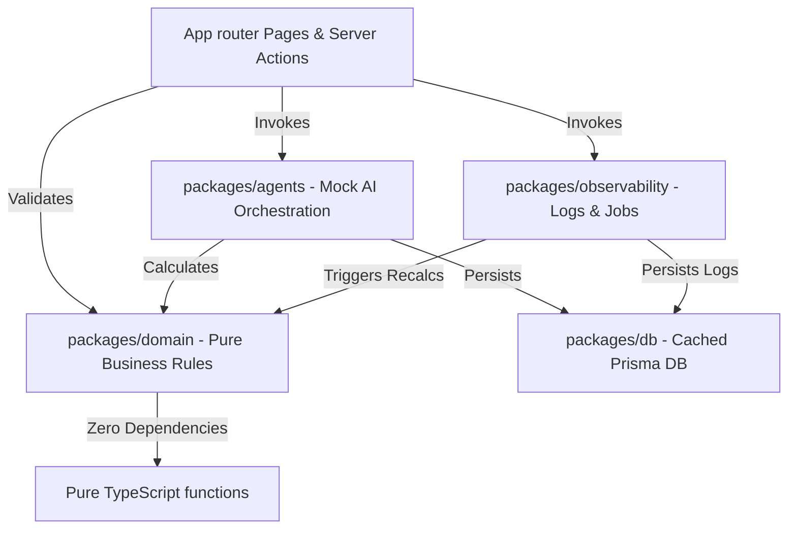

# 🎓 EduOps Platform: Architecture Manual & Training Laboratory

Welcome to the **Agentic Education Operations & LMS** architecture guide. This codebase is designed as an upskilling platform and learning laboratory for software engineers. It models a production-grade enterprise system utilizing a modern, decoupled **Modular Monolith** structure in TypeScript.

---

## 1. System Topology & Architectural Monolith

Rather than a tangled web of imports, this project organizes the application into distinct virtual packages inside `src/packages/`. This mimics a highly scalable corporate ecosystem while keeping the deployment profile local and simple.



### Decoupled Packages

1. **`@/db` (Database Access)**: A centralized, singleton instance of the Prisma Client, configured to prevent SQLite resource leaks during Next.js Hot Module Replacement (HMR).
2. **`@/domain` (Core Business Rules)**: Zero-dependency, pure mathematical and logical formulas. Contains no knowledge of database models, SQL, ORM, or Next.js layout configurations.
3. **`@/observability` (Telemetry & Jobs)**: Manages structured log aggregation, error fingerprint calculations, transactional audit event logging, and the background job execution loop.
4. **`@/agents` (Mock Heuristic AI Engine)**: Standardizes simulated AI prompts. Houses 5 deterministic reasoning engines that generate structured findings, data limitations, and sequential Chain-of-Thought logs.
5. **`@/shared` (Common Utilities)**: Shared enums, types, date-formatting tools, and Role-Based Access Control (RBAC) permission maps.

---

## 2. The Power of Pure Domain Logic

In standard "spaghetti" codebases, grading formulas and risk calculations are often written inside controllers, database triggers, or client-side UI hooks. This makes testing near-impossible and leads to catastrophic data drift.

In this codebase, all calculations are **pure functions** in `src/packages/domain/rules/`:
* **Side-Effect Free**: They take raw, standard arguments (numbers, status strings, timestamps) and return structured outputs. They do not invoke database queries or external network requests.
* **100% Testable**: They can be unit-tested in fractions of a millisecond with zero mock databases, network servers, or setup pipelines required.

### Example: Risk Classification Math (`src/packages/domain/rules/risk.ts`)
```typescript
export function calculateStudentRisk(metrics: {
  gradeAverage: number;
  missingAssignmentsCount: number;
  absencesCount: number;
  tardiesCount: number;
}): StudentRiskResult {
  // Pure mathematical score accumulation...
  // Outputs: Low, Medium, High, Critical
}
```

---

## 3. The Mock Agent Heuristic Framework

To prepare developers for future integrations with Large Language Models (LLMs) and autonomous subagents, the platform implements a structured **Mock Agent Engine** (`src/packages/agents/`):

1. **Input Snapshotting**: The orchestrator queries the exact state of the target entity (e.g. grading backlogs, absences, support note keywords) at the millisecond of execution and locks it into `inputSnapshotJSON`. This mimics prompt injection.
2. **Deterministic Heuristics**: The agent evaluates conditions, scores parameters, and builds a **step-by-step trace array**.
3. **Chain-of-Thought (CoT) Logs**: Step logs are formatted and persisted in `traceJSON`. The UI renders this timeline, letting engineers audit the "thought process" of the agent.
4. **Data Limitation Warnings**: If critical context is missing (e.g. an ungraded homework roster or empty attendance spreadsheets), the agent automatically scales down its `confidenceScore` and writes explicit alerts inside its `limitations` array.

---

## 4. Production-Grade Observability

For junior-to-mid software engineers, the observability cockpit demonstrates how enterprise operations are monitored and maintained in production.

### Structured Logging & Fingerprinting (`src/packages/observability/logging.ts`)
Standard application logs are often unstructured strings like `"Error: failed to email student user_99"`. This makes log aggregation difficult.
Our structured logger:
* Captures correlation `requestId` tags, actors, and metadata.
* Evaluates log messages using a **Fingerprinting Heuristic** which replaces dynamic data (UUIDs, emails, numbers) with stable placeholders (`{uuid}`, `{email}`).
* Writes system logs directly into the SQLite database, enabling the real-time **Log Explorer UI**.

### Transactional Auditing (`src/packages/observability/audit.ts`)
Every database state change is captured. The audit recorder saves the exact `beforeJSON` and `afterJSON` states. The **Audit History UI** allows developers to expand any log to inspect side-by-side JSON diffs, serving as a perfect Change-Data-Capture (CDC) demonstration.

### Asynchronous Background Workers (`src/packages/observability/jobs.ts`)
Simulates an enterprise message queue (like BullMQ or RabbitMQ) utilizing a local, transactional task table.
* Jobs transition: `Queued` ➡️ `Running` ➡️ `Succeeded` / `Failed`.
* If a job fails, the callstack is captured, the attempt counter increments, and the job transitions to `Failed`.
* After exceeding 3 failed attempts, the job is moved to a `DeadLettered` state.
* The **Job Monitor UI** lets developers click "Retry Now" to manually trigger and debug execution failures (such as the seeded `AttendanceSummary` type error).

---

## 5. Staff-Level Upskilling Challenges (Lab Tasks)

To maximize the educational impact of this project, developers are encouraged to complete the following five practical engineering challenges:

### 🧩 Lab 1: Add a new Background Job
* **Goal**: Implement a `GuardianDigest` job.
* **Task**:
  1. Add `'GuardianDigest'` to the `JobType` union in `src/packages/observability/jobs.ts`.
  2. Implement simulated business logic inside the worker switch statement (e.g., fetch a student's active risk status and print a simulated guardian email stream to console).
  3. Enqueue the job using `enqueueJob` whenever a new support note of type `FamilyCommunication` is registered.

### 🧩 Lab 2: Build a new diagnostic Agent
* **Goal**: Create a `StudentBehavioralTrendAgent`.
* **Task**:
  1. Define the agent inside the `AgentType` union in `src/packages/agents/core/types.ts`.
  2. Create a new heuristic script in `src/packages/agents/registry/StudentBehavioralTrendAgent.ts` evaluating counseling notes for behavioral shifts (flagging keywords like "disruptive", "late", "unprepared").
  3. Wire the agent into the orchestrator `src/packages/agents/core/orchestrator.ts` and add a button to trigger it on the student's details page.

### 🧩 Lab 3: Implement an IP-Fingerprint Lock (RBAC Extension)
* **Goal**: Require Multi-Factor or Actor validation for closing counseling plans.
* **Task**:
  1. Modify `src/app/actions.ts` inside `completePlanAction`.
  2. Query the actor's profile and enforce that only the **assigned advisor** of the student, or an **Admin**, has permission to close the counseling case, returning a custom error message to the UI if rejected.

### 🧩 Lab 4: Program a custom Log Aggregator Widget
* **Goal**: Create a dashboard alert for high error fingerprint clusters.
* **Task**:
  1. In `src/app/page.tsx` (Dashboard), query `SystemLog` database logs.
  2. Group logs by `fingerprint` and count them.
  3. Render a warning widget if any error fingerprint signature appears more than 5 times in the last 24 hours.

### 🧩 Lab 5: Write automated Integration Tests
* **Goal**: Verify pure domain rules under extreme capacity margins.
* **Task**:
  1. Add a test script simulating section registration overloads (e.g., attempting to register 30 students into a section with capacity 25).
  2. Assert that the 26th registration returns a waitlist classification, and the 28th returns an absolute capacity rejection.
