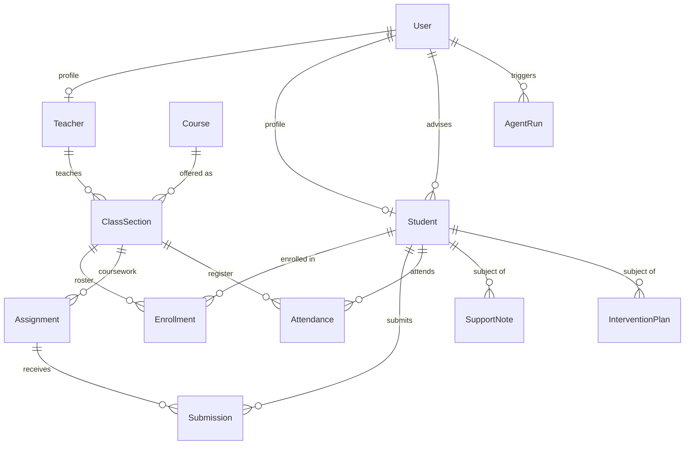
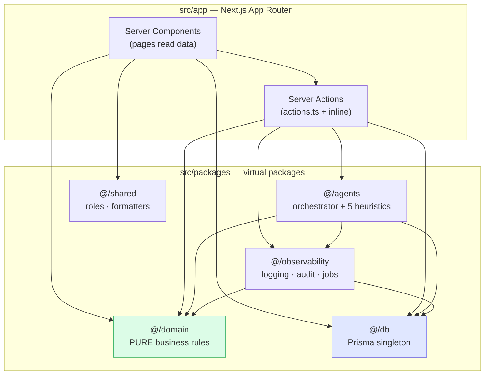
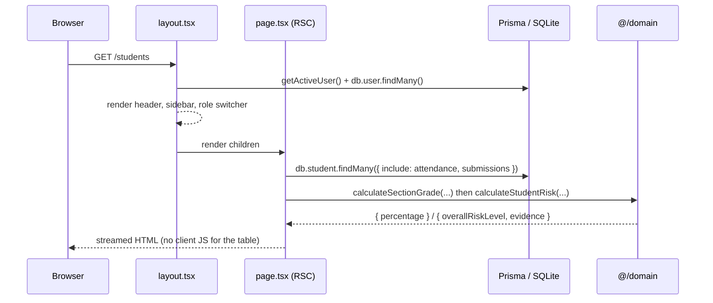

# How This App Works

> **Audience:** a junior engineer joining this codebase.
> **Goal:** by the end of this document you should be able to open any page, predict what
> queries it runs, know where to add a new field, and understand why the folders are
> arranged the way they are.

---

## 1. What is this product?

**EduOps** is a school operations platform. Imagine the back office of a high school: a
school manager registering courses and sections, teachers grading homework and taking
attendance, and an advisor watching for students who are quietly falling behind.

The application has three faces:

1. **A student information system (SIS).** Students, teachers, courses, class sections,
   enrollments, assignments, submissions, attendance, support notes, intervention plans.
2. **An observability cockpit.** Every meaningful action writes a structured log line and
   an audit event; slow work is pushed to a background job table. There are UI pages to
   browse all three.
3. **An agent layer.** Five "analyst" agents read the database, walk through a scoring
   heuristic step by step, and persist a report — narrative summary, findings, concerns,
   recommendations, a confidence score, and the full chain-of-thought trace.

The agents are **deterministic TypeScript**, not an LLM. That is deliberate: it lets you
learn the *shape* of an agentic system (input snapshot → reasoning trace → structured
output → persisted run record → human review UI) without an API key, a bill, or flaky
non-determinism. Swapping the heuristic for a real model later is a contained change.

### The personas (roles)

Roles are stored as a plain string on `User.role`. The union lives in
`src/packages/shared/index.ts:1`.

| Role | What they do in the app |
| --- | --- |
| `Admin` | Everything. Bypasses all permission checks. |
| `SchoolManager` | Registers teachers/students/courses/sections, enrolls and drops students, retries jobs. |
| `Teacher` | Grades submissions, records attendance, writes support notes, runs student agents. |
| `Advisor` | Reads private support notes, creates and closes intervention plans. |
| `Student` | Read-only dashboards (currently **unscoped** — see gotchas). |
| `Parent` | Same as Student today. |
| `Viewer` | Read-only. |

### The demo scenario baked into the seed

`prisma/seed.ts` wipes and rebuilds the database with a story you should know by heart,
because every screenshot and every agent output refers to it:

- **11 users**, including `admin` (Arthur Pendragon), `manager` (Guinevere Vance),
  `advisor_clara` (Clara Vance), and two teachers (Marcus Aurelius, Sarah Connor).
- **2 teachers, 4 students, 4 courses, 3 active class sections** (all `Fall 2026`,
  capacity 20).
- **10 assignments** across Algebra I and Biology, all `Published`.
- **Maya Johnson** is the crisis case: **4 missing Algebra assignments** and a run of
  absences. She has an active intervention plan from Clara Vance.
- **Three background jobs** are pre-seeded: one `Succeeded` GuardianDigest, one `Queued`
  GradeRecalculation, and one **deliberately `Failed`** `AttendanceSummary` job whose
  payload has `runDate: null`. Retrying it reproduces the exact `TypeError` — that job is
  a teaching fixture, not a bug to "fix" (see `src/packages/observability/jobs.ts:131`).

---

## 2. The technology stack

| Layer | Choice | Notes |
| --- | --- | --- |
| Framework | **Next.js 14.2 App Router** | Every page is an `async` React **Server Component**. |
| UI | React 18, plain CSS + inline styles | No Tailwind, no component library. Design tokens are CSS variables in `src/styles/variables.css`. |
| Mutations | **Server Actions** (`'use server'`) | No REST/tRPC/GraphQL API layer at all. |
| Database | **SQLite** via **Prisma 5** | File at `prisma/dev.db`. Schema-push workflow — there is no `prisma/migrations/` folder. |
| Language | TypeScript 5.4, `strict: true` | Path aliases per package (see below). |
| Validation | `zod` is installed… | …and never imported. See gotchas. |

**There is no authentication.** `src/packages/shared/auth.ts` reads a `mock_user_id`
cookie and falls back to the `admin` user. The header dropdown (`SwitcherLink`) lets you
become anybody instantly. This is a lab, not a deployment.

---

## 3. The data model

15 Prisma models in `prisma/schema.prisma`. Note the conventions:

- Primary keys are `String @id @default(uuid())`.
- **There are no Prisma enums.** Every status is a `String` with the legal values listed
  in a trailing comment (e.g. `status String // Draft, Published, Closed`). This is
  because SQLite has weak enum support — but it means **nothing stops you writing a typo
  into the database**. Validation is your job.
- Anything structured-but-flexible is stored as a JSON string with a `JSON` suffix:
  `scheduleJSON`, `subjectsJSON`, `payloadJSON`, `inputSnapshotJSON`, `outputJSON`,
  `traceJSON`, `beforeJSON`, `afterJSON`, `metadataJSON`.



Plus four "sidecar" tables with no foreign keys into the academic graph — they are
append-only records *about* the system rather than part of it:

- `SystemLog` — structured application logs (has a `fingerprint` for grouping).
- `AuditEvent` — before/after JSON snapshots of every mutation.
- `BackgroundJob` — the simulated queue.
- `AgentRun` — one row per agent execution.

### Constraints worth memorising

| Model | Constraint | Why it matters |
| --- | --- | --- |
| `Enrollment` | `@@unique([studentId, classSectionId])` | A student can never appear twice on a roster — including as `Dropped`. Re-enrolling after a drop will violate this. |
| `Submission` | `@@unique([assignmentId, studentId])` | One submission row per student per assignment. Use `upsert`. |
| `Attendance` | `@@unique([studentId, classSectionId, date])` | Attendance is idempotent per day. `recordAttendanceAction` relies on this. |
| `ClassSection.teacher` | `onDelete: Restrict` | You cannot delete a teacher who still has sections. Deliberate. |
| `Teacher.user` / `Student.user` | `onDelete: SetNull` | Profiles survive account deletion. |

---

## 4. The architecture: a modular monolith

Everything ships as one Next.js app, but the code is split into five *virtual packages*
under `src/packages/`, each with its own TypeScript path alias (`tsconfig.json:22-36`).
The aliases exist to make illegal imports feel wrong: you import `@/domain/rules/grades`,
not `../../../packages/domain/rules/grades`.



### The dependency rule (the one rule to not break)

**`@/domain` imports nothing.** No Prisma, no Next.js, no logger. It takes plain numbers
and strings and returns plain objects. That is what makes it trivially unit-testable, and
it is the reason the same grade formula can be called from a page, a Server Action, a
background job, and an agent without any of them diverging.

Everything else may depend on `@/domain`. Nothing in `@/domain` may depend on anything
else. If you find yourself wanting to query the database inside a rule function, the fix
is to fetch in the caller and pass the facts in — look at
`src/packages/agents/core/orchestrator.ts:127-133` for the pattern.

### The five packages

#### `@/db` — `src/packages/db/index.ts` (17 lines)

A Prisma client singleton stashed on `globalThis` in development. This exists because
Next.js hot-reload re-evaluates modules and would otherwise open a new SQLite connection
on every save until the process dies. Always `import { db } from '@/db'`.

#### `@/domain` — `src/packages/domain/rules/` (four files, ~380 lines)

The business math. Read all four; they are short and they are the heart of the app.

| File | Exports | What it decides |
| --- | --- | --- |
| `grades.ts` | `calculateSectionGrade`, `classifyGradeScore`, `calculateClassAverage` | Percentage from submissions. `Missing` counts as 0-of-possible; ungraded `Submitted` work is excluded entirely so students aren't punished for a teacher's backlog. |
| `risk.ts` | `calculateStudentRisk` | Blends grades, absences (tardies weighted ×0.3), and missing work into `Low`/`Medium`/`High`/`Critical` plus a primary risk area and an evidence list. |
| `enrollment.ts` | `validateEnrollmentRules` | Six gates in order: duplicate → student withdrawn/graduated → section cancelled/completed → teacher inactive → capacity. Returns `{ isValid, canWaitlist, reason }`. Capacity is the **only** failure that offers a waitlist. |
| `workload.ts` | `calculateTeacherWorkload` | Scores a teacher 0-100+: 20/section, 0.5/seat, 2/ungraded submission, 5/at-risk student, plus a 30/section penalty if they're `OnLeave`. Buckets into Underloaded / Optimal / Overloaded / Critically Overloaded. |

#### `@/observability` — `src/packages/observability/`

Three concerns, one package:

- **`logging.ts`** — a `logger` singleton with `debug/info/warn/error/fatal`. Every call
  writes to `console` *and* inserts a `SystemLog` row. The interesting part is
  `generateFingerprint()` (line 19): it lowercases the message and replaces UUIDs, emails
  and long numbers with `{uuid}`, `{email}`, `{number}`, then prefixes the service name.
  That gives you a stable grouping key so "the same error 400 times" collapses to one
  signature. DB write failures are swallowed so logging can never break a request.

- **`audit.ts`** — `recordAuditEvent({ actorId, action, entityType, entityId, before, after })`
  writes an `AuditEvent` with `JSON.stringify`'d before/after snapshots, then emits an
  info log. It is **fail-open**: if the audit insert throws, the error is logged and the
  caller continues. That's a deliberate trade-off (availability over auditability) and a
  great thing to argue about in a design review.

- **`jobs.ts`** — the simulated queue. `enqueueJob(type, payload, relations)` inserts a
  `Queued` row. `runJob(jobId)` flips it to `Running`, increments `attempts`, executes a
  `switch` on job type, and lands on `Succeeded`, `Failed`, or `DeadLettered`
  (once `attempts >= maxAttempts`). Only `GradeRecalculation` does real work — it
  recalculates `Enrollment.finalGrade` for every enrolled student in a section.
  **There is no worker process**: `enqueueJob` does not run anything. Queued jobs sit
  there until a human clicks "Retry Now" on `/jobs`.

#### `@/agents` — `src/packages/agents/`

```
core/types.ts        AgentType, AgentTargetType, AgentOutput, AgentRecommendation
core/orchestrator.ts executeAgentRun() — the only entry point
registry/*.ts        five pure heuristic functions
```

The **orchestrator** is the interesting file. Its contract:

1. Insert an `AgentRun` row with status `Pending` **before doing any work**, so a crash
   still leaves a trace.
2. `switch` on `agentType` to load exactly the facts that agent needs, and validate the
   target type matches (`AtRiskStudentDetection` on a `Teacher` throws).
3. Build a plain-JSON `agentInput` object — **this is the "prompt"**. It is snapshotted
   into `inputSnapshotJSON` so you can later see precisely what the agent knew.
4. Call the registry function. Registry functions are **pure**: `(input) => { output, trace }`.
   They never touch the database.
5. Persist `Succeeded` with the output, confidence, and trace; write an audit event and a log.
6. On any throw: persist `Failed` with the message, log at error level, and **return the
   run id rather than rethrowing** — a failed analysis must not 500 the page.

The five agents:

| Agent | Target | Signature output |
| --- | --- | --- |
| `StudentProgressSummary` | Student | Narrative report; compares first-half vs second-half graded scores to detect a trajectory; lowers confidence when attendance or submission data is missing. |
| `AtRiskStudentDetection` | Student | 0–100 risk score (grades 40/25, absences ×8, tardies ×2.5, missing work 30/15, escalation keywords +10) → Low/Medium/High/Critical + escalation recommendations. |
| `AssignmentFeedback` | Submission | Drafts student-facing feedback text and teacher grading notes based on score band and lateness. **No UI triggers this today.** |
| `AttendanceAnomaly` | Student **or** ClassSection | For a student: longest consecutive-absence streak + tardy clusters. For a section: a single day where ≥40% of the roster was absent (field trip? sync failure?). |
| `TeacherWorkloadInsight` | Teacher | Wraps `calculateTeacherWorkload` and turns warnings into staffing recommendations. The clearest example of an agent delegating to a domain rule. |

Every agent returns the same `AgentOutput` shape (`core/types.ts:16`): `summary`,
`strengths`, `concerns`, `confidenceScore`, `findings`, `recommendations`, `limitations`,
`metadata`. Because the shape is uniform, `/agent-runs/[id]` can render *any* agent's
result with one component. **If you add an agent, do not invent a new output shape.**

The `limitations` array plus a reduced `confidenceScore` is the honesty mechanism: when
an agent has no attendance data it says so and drops confidence by 0.15
(`StudentProgressSummaryAgent.ts:64-68`) instead of silently guessing.

#### `@/shared` — `src/packages/shared/`

- `index.ts` — the `UserRole` union, `canPerformAction(role, action)` (a central
  permission table), `formatDate` / `formatDateTime`, and badge-style helpers.
- `auth.ts` — `getActiveUser()`, the cookie-based mock session.

> ⚠️ `canPerformAction` is **never called anywhere**. Pages hard-code
> `['Admin','SchoolManager'].includes(activeUser.role)` inline instead. Story 13 fixes this.

---

## 5. How a request actually flows

### Reading a page

Every page is an `async` Server Component with `export const revalidate = 0`, which
disables caching so the cockpit always shows live data.



Note what is **not** there: no API route, no `useEffect`, no loading spinner, no client
state. The page function *is* the query layer. The only client component in the entire
app is `src/app/components/SwitcherLink.tsx`.

### Writing data (a mutation)

Take "teacher grades a submission" — the fullest path in the app.

```mermaid
sequenceDiagram
    participant B as Browser
    participant F as "<form action={handleGrade}>"
    participant A as saveGradeAction (actions.ts)
    participant DB as Prisma
    participant AU as recordAuditEvent
    participant J as enqueueJob
    participant L as logger

    B->>F: submit score + feedback
    F->>A: saveGradeAction({ submissionId, score, feedback, actorId })
    A->>DB: findUniqueOrThrow(submission + assignment)
    A->>A: guard: score > pointsPossible -> throw
    A->>DB: update submission (score, feedback, status Graded, gradedAt)
    A->>AU: recordAuditEvent('submission.grade', before, after)
    AU->>DB: insert AuditEvent
    AU->>L: logger.info(...) -> insert SystemLog
    A->>J: enqueueJob('GradeRecalculation', { sectionId })
    J->>DB: insert BackgroundJob (status Queued)
    J->>L: logger.info(...) -> insert SystemLog
    A->>A: revalidatePath(...)
    A-->>B: re-rendered page
```



**The pattern every mutation follows — copy this:**

1. Fetch the "before" state (needed for the audit diff).
2. Run domain validation (a pure function) before touching the DB.
3. Mutate.
4. `recordAuditEvent(...)` with before + after.
5. `enqueueJob(...)` for anything derived or slow.
6. `revalidatePath(...)` for every route whose output changed.

Skip step 6 and the button will appear to do nothing.

### Two flavours of Server Action

You will see both; know when to use which.

- **Shared actions** — `src/app/actions.ts`, marked `'use server'` at the top of the
  file. Used when several pages need the same mutation (`enrollStudentAction`,
  `saveGradeAction`, `recordAttendanceAction`, …).
- **Inline actions** — an `async function` with `'use server'` *inside* the page
  component, e.g. `createTeacherAction` in `src/app/teachers/page.tsx:18` or
  `completePlanAction` in `src/app/interventions/page.tsx:15`. These can close over
  variables already computed during render (like `sectionId` or `activeUser`), which is
  why the section page wraps the shared actions in local `handleX(formData)` functions
  (`src/app/sections/[id]/page.tsx:53-96`).

Data reaches an action through `<form action={handler}>` and `formData.get('name')`, or
through `<input type="hidden">` for row identifiers. There is no client-side fetch
anywhere.

---

## 6. Page-by-page map

Navigation lives in `src/app/layout.tsx` and is split into "Academic Operations" and
"Observability Cockpit".

| Route | File | What it does |
| --- | --- | --- |
| `/` | `app/page.tsx` | Operations cockpit: 4 KPI cards, live risk-tier distribution computed for **every** student on every render, latest 4 agent runs, latest 5 audit events. |
| `/teachers` | `app/teachers/page.tsx` | Teacher cards with a live workload score bar + a create-teacher form (Admin/SchoolManager). Triggers `TeacherWorkloadInsight`. |
| `/students` | `app/students/page.tsx` | Roster table with computed average, absences, missing count, risk tier + create-student form. |
| `/students/[id]` | `app/students/[id]/page.tsx` | **The richest page (522 lines).** Profile banner with live risk badge, agent trigger panel, enrollments table with drop + enroll-into-section form, attendance chronology, RBAC-filtered support notes with create form, intervention plans with create form. |
| `/courses` | `app/courses/page.tsx` | Catalog table + create-course form. |
| `/sections` | `app/sections/page.tsx` | Section table with seat fill % and FULL/OPEN badge + create-section form. |
| `/sections/[id]` | `app/sections/[id]/page.tsx` | Roster + waitlist, the grading cockpit (only shows submissions with status `Submitted`), the daily attendance register, and the `AttendanceAnomaly` agent panel. |
| `/interventions` | `app/interventions/page.tsx` | All intervention plans + "Close Case" action. |
| `/jobs` | `app/jobs/page.tsx` | Background job table with payload, full callstack on failure, and "Retry Now". |
| `/logs` | `app/logs/page.tsx` | Log explorer, filtered by level and service via URL search params, capped at 50 rows. |
| `/agent-runs` | `app/agent-runs/page.tsx` | Every agent execution with status and confidence. |
| `/agent-runs/[id]` | `app/agent-runs/[id]/page.tsx` | The payoff page: the step-by-step reasoning trace, the exact input snapshot JSON, and the rendered output (summary, strengths, concerns, recommendations with owner + urgency, self-reported limitations). |
| `/audits` | `app/audits/page.tsx` | Audit table with an expandable before/after JSON diff per row. |

**Routes that do not exist but are referenced:** `/assignments/[id]` and
`/sections/[id]/gradebook` are passed to `revalidatePath` in `actions.ts:209-211`.
Revalidating a non-existent path is a harmless no-op, but it tells you those pages were
planned. Two of the user stories build them.

---

## 7. How RBAC actually works today

Two independent mechanisms, only one of which is wired up:

1. **Inline UI gating (what's actually used).** Pages check
   `['Admin','SchoolManager'].includes(activeUser.role)` and render either the control or
   a `🔒` message. Grep for `activeUser.role` — you'll find ~15 of these arrays, and they
   are not all consistent with one another.
2. **A central permission table (unused).** `canPerformAction(role, action)` in
   `src/packages/shared/index.ts:17` maps action strings like `'submission.grade'` and
   `'intervention.create'` to roles. Nothing calls it.

The support-notes filter on `/students/[id]:67-74` is the one place with genuine *data*
filtering rather than button hiding — notes have a `visibility` of `Shared`,
`TeacherOnly`, `AdvisorOnly`, or `AdminOnly`, and the page filters the array after
fetching.

Critically: **Server Actions perform no authorization checks at all.** They receive an
`actorId` and trust it. Hiding a button hides it from the UI, not from anyone who can
POST to the action endpoint. Stories 13 and 15 address this.

---

## 8. Running it locally

`node_modules/` is **not** present in this checkout, so start from scratch:

```bash
npm install                 # install deps (also runs `prisma generate` via postinstall in Prisma 5)
npx prisma generate         # run explicitly if the client wasn't generated
npm run db:push             # sync prisma/schema.prisma -> prisma/dev.db
npm run db:seed             # WIPES the DB and rebuilds the demo scenario
npm run dev                 # http://localhost:3000
```

`prisma/dev.db` is committed and already seeded, so `db:push` + `db:seed` are only
strictly needed after a schema change — but re-seeding is the fastest way to get back to
a clean, known state after you've made a mess.

Other scripts:

| Command | Status |
| --- | --- |
| `npm run build` | Your real gate. Next.js runs the full strict TypeScript check. |
| `npm run db:studio` | Prisma Studio — browse/edit tables in a GUI. Very useful. |
| `npm test` | Points at `node --import tsx --test tests/*.test.ts`, but **`tests/` does not exist**. Story 4 creates it. |
| `npm run lint` | There is no ESLint config in the repo, so `next lint` will interactively prompt you to create one. |

**After changing `prisma/schema.prisma`** you must run `npm run db:push` *and* restart
`npm run dev`, or the Prisma client types will be stale and TypeScript will fight you
over a field that exists in the database.

---

## 9. Conventions to follow

Match these and your PR will look native:

1. **Fetch in the Server Component, compute with a domain function.** Never put a formula
   in JSX.
2. **New business rule? New pure function in `src/packages/domain/rules/`.** No imports.
3. **Every mutation writes an audit event.** Use the action-name convention
   `entity.verb` — `enrollment.drop`, `submission.grade`, `intervention.complete`.
4. **Anything derived, slow, or fan-out goes through `enqueueJob`.** Grades recalculate
   in a job, not inline.
5. **`revalidatePath` every affected route** at the end of the action.
6. **Import through the alias**: `@/db`, `@/domain/rules/x`, `@/observability/jobs`,
   `@/agents/core/orchestrator`, `@/shared`.
7. **Statuses are strings, so validate them.** There is no database-level enum protecting
   you.
8. **Styling:** `className="card"`, `"data-table"`, `"badge badge-success"`, `"btn btn-primary btn-sm"`,
   `"form-control"`, `"form-group"` from `src/styles/global.css`; colours via
   `var(--color-*)` tokens from `src/styles/variables.css`. Inline `style={{}}` for layout
   is the house style — don't introduce a CSS framework for one ticket.
9. **Agents return `AgentOutput`.** Same shape, always, so the trace viewer keeps working.

Now read [`02-codebase-gotchas.md`](02-codebase-gotchas.md) before you write anything.
